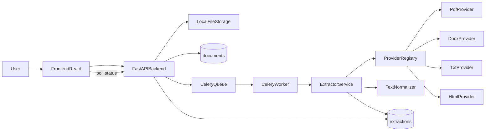
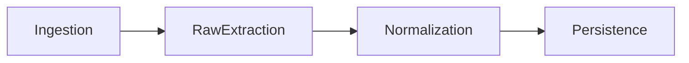
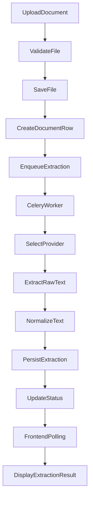
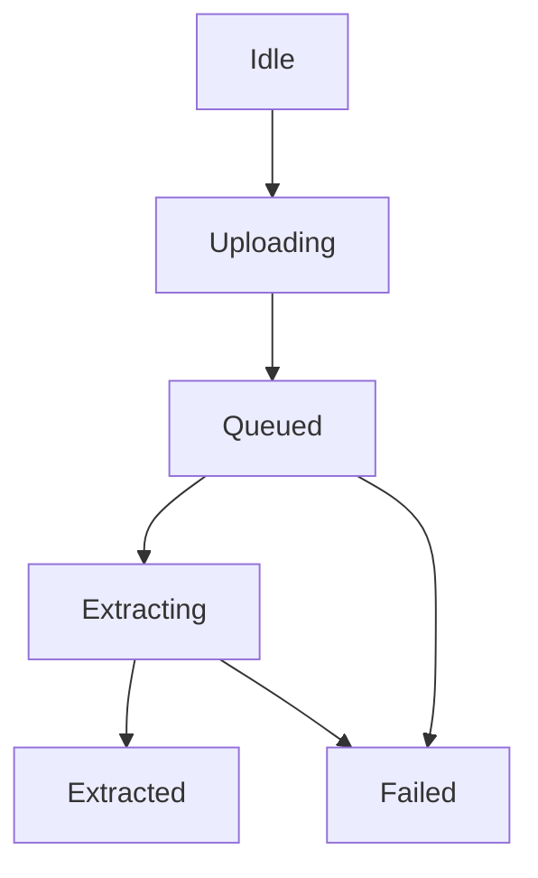

# Legal-Tech Compliance Platform (PFE)

## Agent 1 Report

This repository currently implements **Agent 1: Extractor Agent**.

Agent 1 is responsible for:
- receiving uploaded documents,
- validating file type and size,
- storing files safely,
- extracting raw text from supported formats,
- normalizing extracted text,
- persisting extraction results,
- exposing extraction status and output to the frontend,
- preparing clean input for future agents.

At this stage, Agent 1 is implemented as a complete slice:
- FastAPI backend
- PostgreSQL database
- Redis + Celery worker
- React frontend for upload, polling, and extraction review
- Alembic migration scaffolding
- backend tests

## What Agent 1 Does Exactly

### Supported input formats
- `PDF`
- `DOCX`
- `TXT`
- `HTML`

### Current outputs
- document metadata
- raw extracted text
- normalized text
- optional structure metadata
- optional page metadata
- warnings
- errors

### Current status lifecycle
- `queued`
- `extracting`
- `extracted`
- `failed`

### Not implemented yet
- OCR execution for scanned documents
- anonymization pipeline
- S3/object storage
- authentication and RBAC
- clause segmentation
- compliance analysis

## Main Technologies Used

### Backend
- `Python 3.12`
- `FastAPI`
- `Pydantic`
- `SQLAlchemy`
- `Alembic`
- `Celery`
- `Redis`
- `LangGraph`

### Extraction layer
- `PyMuPDF` for PDF
- `python-docx` for DOCX
- `BeautifulSoup4` for HTML
- Python stdlib decoding for TXT

### Frontend
- `React`
- `TypeScript`
- `Vite`
- `Tailwind CSS`

### Infrastructure
- `Docker`
- `docker-compose`
- `PostgreSQL`

## Why These Technologies Were Used

- `FastAPI`: typed APIs, OpenAPI docs, good structure for service-oriented backend code.
- `Pydantic`: strict request/response schemas and extraction artifacts.
- `SQLAlchemy`: maintainable persistence for `documents` and `extractions`.
- `Alembic`: database schema versioning.
- `Celery + Redis`: extraction should run asynchronously and not block the request.
- `LangGraph`: prepares the future multi-agent workflow, even though Agent 1 is still mostly deterministic.
- `PyMuPDF`, `python-docx`, `BeautifulSoup4`: practical open-source extraction tools for MVP and PFE scope.
- `React + TypeScript`: strong frontend base for later legal dashboard modules.
- `Docker Compose`: simple local orchestration of the whole stack.

## Agent 1 High-Level Architecture



## Internal Logic of Agent 1

Agent 1 works in four internal phases:



### 1. Ingestion
- receives upload from API
- validates MIME type
- validates extension
- validates max size
- stores the file locally
- creates a `documents` row
- queues extraction

### 2. Raw Extraction
- worker calls `ExtractorService`
- provider registry selects the correct extractor by MIME type
- provider extracts text and optional structure/page metadata

### 3. Normalization
- converts text safely to UTF-8
- normalizes line endings
- collapses repeated spaces
- preserves paragraph breaks

### 4. Persistence
- stores extraction artifact in `extractions`
- updates `documents.status`
- exposes result through API for frontend consumption

## End-to-End Workflow



### User-facing workflow
1. User uploads a contract from the frontend.
2. Backend validates and stores the file.
3. Backend inserts a `queued` document record.
4. Celery worker picks the extraction task.
5. Worker extracts raw text and optional structure.
6. Text is normalized.
7. Extraction result is stored in DB.
8. Frontend polls status and fetches the extraction result.
9. User sees raw text, normalized text, warnings, and structure.

## Backend Components

### API layer
- `backend/app/api/routes/documents.py`

Responsibilities:
- upload endpoint
- document status endpoint
- extraction result endpoint

### Service layer
- `backend/app/services/ingestion/extractor_service.py`
- `backend/app/services/ingestion/normalizer.py`
- `backend/app/services/ingestion/storage.py`

Responsibilities:
- orchestrate extraction
- normalize text
- save files

### Providers
- `backend/app/services/ingestion/providers/txt.py`
- `backend/app/services/ingestion/providers/pdf.py`
- `backend/app/services/ingestion/providers/docx.py`
- `backend/app/services/ingestion/providers/html.py`
- `backend/app/services/ingestion/providers/ocr.py`
- `backend/app/services/ingestion/providers/registry.py`

Responsibilities:
- isolate extraction logic by document type
- keep the extractor extensible

### Background jobs
- `backend/app/tasks/celery_app.py`
- `backend/app/tasks/extraction.py`

Responsibilities:
- queue extraction tasks
- run extraction in worker
- update document status

### Persistence
- `backend/app/db/models/document.py`

Main tables:
- `documents`
- `extractions`

### Workflow preparation
- `backend/app/workflows/extract_node.py`
- `backend/app/workflows/graph.py`

This is the LangGraph-ready entry point for future multi-agent orchestration.

## Provider Logic

### TXT provider
- reads bytes from file
- attempts decoding with:
  - `utf-8`
  - `utf-8-sig`
  - `latin-1`
  - `cp1252`
- returns warning for empty files

### PDF provider
- uses `PyMuPDF`
- extracts page-by-page text
- builds page metadata
- warns when document looks scanned

### DOCX provider
- uses `python-docx`
- extracts paragraph text
- detects headings by style name
- builds simple paragraph/heading structure

### HTML provider
- uses `BeautifulSoup`
- removes script/style tags
- extracts visible text
- extracts heading structure from `h1` to `h6`

### OCR provider
- scaffold only
- returns a clear “not implemented yet” error

## Data Model

### `documents`
Contains:
- file identity
- storage path
- MIME type
- size
- extraction status
- Celery task id
- timestamps

### `extractions`
Contains:
- raw text
- normalized text
- structure JSON
- page metadata JSON
- warnings
- error message
- timestamp

## API Endpoints

### `POST /documents/upload`
Creates a document and queues extraction.

### `GET /documents/{id}`
Returns document metadata and current status.

### `GET /documents/{id}/extraction`
Returns the latest extraction artifact.

### `GET /health`
Health check endpoint.

## Frontend Logic

Frontend is implemented as a single Agent 1 workspace.

Main page:
- `frontend/src/pages/UploadPage.tsx`

Main components:
- `UploadDropzone`
- `DocumentStatusCard`
- `ExtractionViewer`

Frontend workflow:
1. user selects or drops file
2. frontend uploads file
3. frontend stores returned `documentId`
4. frontend polls:
   - `/documents/{id}`
   - `/documents/{id}/extraction`
5. frontend displays result

## Frontend State Logic



## Docker Stack

`docker-compose.yml` runs:
- `db` -> PostgreSQL
- `redis` -> broker/backend for Celery
- `backend` -> FastAPI API
- `worker` -> Celery extraction worker
- `frontend` -> React UI

## Quality Practices Already Applied

- provider pattern for extractor implementations
- separation between API, service, storage, providers, DB, tasks
- typed schemas for API and extraction artifacts
- async extraction architecture
- migration scaffolding with Alembic
- structured logging foundation
- backend tests for normalizer, registry, providers, service, and API flow
- CORS setup for frontend/backend communication

## Current Limitations

- no authentication yet
- no OCR implementation yet
- local file storage only
- no object storage abstraction beyond local helper
- no antivirus or deep file-content scanning
- no audit log table yet
- no advanced observability yet
- no Agent 2 NLP processing yet

## How Agent 1 Prepares Agent 2

Agent 1 outputs:
- reliable stored document metadata
- normalized text
- optional structure metadata
- warnings and extraction errors

These outputs are the future inputs for:
- clause segmentation
- clause classification
- entity extraction
- compliance evaluation

## Run The Stack

```bash
docker compose up -d --build
```

Available services:
- Backend API: `http://localhost:8000`
- OpenAPI docs: `http://localhost:8000/docs`
- Frontend: `http://localhost:4173`

## Test Agent 1

### Manual test
1. open frontend at `http://localhost:4173`
2. upload a `PDF`, `DOCX`, `TXT`, or `HTML` file
3. watch status move from `queued` to `extracting` to `extracted`
4. inspect:
   - raw text
   - normalized text
   - warnings
   - structure metadata

### Automated backend tests

```bash
cd backend
pytest
```

## Current Project Structure

- `backend/` — API, services, providers, tasks, workflow, models, tests, migrations
- `frontend/` — upload UI and extraction viewer
- `docs/` — extra documentation (see below)
- `scripts/` — dataset download, conversion, synthetic data, training, evaluation
- `data/` — raw datasets, converted clauses, annotated splits, trained models (see [docs/DATASETS.md](docs/DATASETS.md))
- `docker-compose.yml` — local infrastructure stack

### ML datasets and Agent 2 training

Full guide (CUAD, LEDGAR, synthetic French, folder layout, JSON schemas, pipeline commands, troubleshooting): **[docs/DATASETS.md](docs/DATASETS.md)**.

## Summary

Agent 1 is a **document ingestion and extraction subsystem** built with a clean provider-based architecture.

It already delivers:
- upload,
- validation,
- asynchronous extraction,
- normalization,
- persistence,
- frontend visualization,
- and workflow readiness for the next agents.

It is the foundation of the rest of the legal-tech platform.
