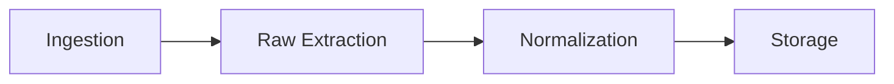

# Agent 1 — Extractor Agent: Implementation Plan

## 1. Role and Boundaries

**Responsibility:** Accept an uploaded contract file, identify its type, extract text (and structure when possible), normalize it, persist the result, and return a typed artifact for the rest of the pipeline.

**Inputs:** File path (or bytes), filename, MIME type, optional `document_id` (if re-analysis).

**Outputs:**

- `document_metadata`: filename, mime_type, size, page_count (if available)
- `raw_text`: full text as extracted by the provider
- `normalized_text`: cleaned, consistent encoding/whitespace
- `structure`: optional JSON (sections, headings, page/block boundaries)
- `page_metadata`: optional per-page or per-block info
- `warnings` / `errors`: extraction issues (e.g. password-protected PDF, OCR suggested)

**Out of scope for Agent 1:** Clause segmentation, compliance, recommendations. Anonymization is a future step (scaffold only: interface or placeholder in normalization).

---

## 2. The Four Phases (Internal Steps)



| Phase | Purpose | Owner / location |

|-------|--------|-------------------|

| **1. Ingestion** | Validate file type/size, resolve path, ensure document record exists. | API route + service facade |

| **2. Raw extraction** | Dispatch to correct provider; get raw text + structure. | `services/ingestion/providers/` |

| **3. Normalization** | Clean text (encoding, whitespace, line breaks); optional structure normalization. | `services/ingestion/normalizer.py` |

| **4. Storage** | Persist extraction to DB (extractions table); return structured result. | `services/ingestion/extractor_service.py` |

Ingestion can be split: **upload endpoint** creates the document and stores the file; **extraction job** (or LangGraph node) runs phases 2–4. The “Extractor Agent” as a single unit = phases 2 + 3 + 4 (raw extraction → normalization → storage).

---

## 3. Provider Pattern (Raw Extraction)

- **Interface:** One abstract base class or protocol, e.g. `DocumentExtractorProvider`.
  - Method: `extract(file_path: Path, mime_type: str) -> RawExtractionResult`.
- **RawExtractionResult:** Pydantic model with: `raw_text`, `structure` (optional), `page_metadata` (optional), `warnings`, `error` (optional).
- **Implementations:**
  - **PDF:** PyMuPDF — text + optional blocks/positions; detect if scanned (e.g. very little text) and set a warning “consider OCR”.
  - **DOCX:** python-docx — paragraphs, headings; build simple structure (sections/headings).
  - **TXT:** read with explicit encoding (utf-8, fallback); no structure or single “body” block.
  - **HTML:** BeautifulSoup or lxml — strip tags to text; optional heading/section structure.
- **OCR:** Scaffold only: a stub provider that raises “not implemented” or returns a placeholder; later integrate Tesseract.
- **Registry:** Map MIME type (and/or extension) → provider instance. Unknown type → clear error (no silent fallback).

**Suggested backend layout:**

```
backend/app/services/ingestion/
  __init__.py
  types.py              # RawExtractionResult, NormalizedExtraction, ExtractionArtifact
  extractor_service.py  # Orchestrates: provider.extract() → normalizer → storage
  normalizer.py         # Phase 3: clean text, optional structure
  providers/
    __init__.py         # Registry: get_provider(mime_type)
    base.py             # DocumentExtractorProvider protocol/ABC
    pdf.py              # PyMuPDF
    docx.py             # python-docx
    txt.py
    html.py
    ocr.py              # Stub for later Tesseract
```

---

## 4. Normalization (Phase 3)

- **Input:** `RawExtractionResult` (raw_text, structure, warnings).
- **Output:** `NormalizedExtraction` (normalized_text, normalized_structure?, warnings carried over).
- **Actions:**
  - Encoding: ensure UTF-8, replace invalid sequences.
  - Whitespace: collapse multiple spaces/newlines to a consistent pattern (e.g. single space, single newline between paragraphs).
  - Optional: detect paragraph boundaries (double newline) and keep them for downstream segmentation.
- **Future:** Anonymization hook (e.g. interface `anonymize(text) -> text`); not implemented in MVP, just a clear extension point.

---

## 5. Storage (Phase 4) and Data Model

- **Table:** `extractions` (from main architecture plan):
  - `id`, `document_id`, `raw_text`, `normalized_text`, `structure_json`, `page_metadata_json`, `warnings`, `error_message`, `created_at`.
- **Extractor Agent** writes one row per successful run; re-analysis can insert a new row (and optionally link to `document_versions` if we version by upload).
- **Return:** An in-memory `ExtractionArtifact` (or equivalent) used by LangGraph state: same fields as the API response schema (document_metadata, raw_text, normalized_text, structure, page_metadata, warnings, errors).

---

## 6. Integration Points

- **API:**  
  - `POST /documents` (or `/documents/upload`): upload file → create `documents` row, store file, enqueue extraction job.  
  - `GET /documents/{id}`: include extraction status; `GET /documents/{id}/extraction`: return last extraction (raw/normalized text, structure, warnings).  
- **Celery:** One task, e.g. `run_extraction(document_id)`: load document record, get file path, call `ExtractorService.run(document_id, file_path, mime_type)`, then update document status and optionally trigger analysis.  
- **LangGraph:** Node `extract_document`: given `document_id` (and file path from state or DB), call the same `ExtractorService.run()`, write result into state (`extraction_result`, `normalized_text`) and persist to DB. So one implementation (ExtractorService) serves both “job” and “graph node”.

---

## 7. Implementation Order (Agent 1 Only)

| Step | What | Deliverables |

|------|------|--------------|

| **1** | Types and interface | `types.py`: RawExtractionResult, NormalizedExtraction, ExtractionArtifact. `providers/base.py`: protocol/ABC and docstrings. |

| **2** | TXT provider | `providers/txt.py`: read file, return raw text; encoding handling. |

| **3** | PDF provider | `providers/pdf.py`: PyMuPDF, text + optional structure; “scanned” warning. |

| **4** | DOCX provider | `providers/docx.py`: python-docx, paragraphs/headings, simple structure. |

| **5** | HTML provider | `providers/html.py`: parse to text + optional sections. |

| **6** | OCR stub | `providers/ocr.py`: stub raising or placeholder for future Tesseract. |

| **7** | Provider registry | `providers/__init__.py`: map mime types to providers; `get_provider()`. |

| **8** | Normalizer | `normalizer.py`: encoding + whitespace; input/output types above. |

| **9** | Extractor service | `extractor_service.py`: get provider → extract → normalize → persist extraction → return artifact. |

| **10** | API + job wiring | Upload endpoint, document record, Celery task calling ExtractorService; optional `GET /documents/{id}/extraction`. |

| **11** | LangGraph node | Node `extract_document` calls ExtractorService and updates state. |

---

## 8. Error and Edge Cases

- **Unsupported type:** Return 400 or 422 with clear message; do not run extraction.
- **Missing/corrupt file:** Log, set extraction error_message, document status = failed.
- **Password-protected PDF:** Provider returns error/warning; no crash; store error in extraction row.
- **Empty extraction:** Allow it; store empty normalized_text and a warning “no text extracted”.
- **Very large file:** Already handled by async job (Celery); consider size limit in upload (e.g. env `MAX_UPLOAD_MB`).

---

## 9. Files to Create or Touch (Summary)

**New under `backend/app/`:**

- `services/ingestion/types.py`
- `services/ingestion/normalizer.py`
- `services/ingestion/extractor_service.py`
- `services/ingestion/providers/base.py`
- `services/ingestion/providers/txt.py`
- `services/ingestion/providers/pdf.py`
- `services/ingestion/providers/docx.py`
- `services/ingestion/providers/html.py`
- `services/ingestion/providers/ocr.py`
- `services/ingestion/providers/__init__.py` (registry)

**Existing to extend:** API routes (documents upload, get extraction), DB model `Extraction`, Celery task, LangGraph state + node (when we build the graph).

---

## 10. Success Criteria for Agent 1

- Upload a PDF, DOCX, TXT, or HTML contract → document record created, file stored.
- Extraction job runs (or graph node runs) → `extractions` row created with `raw_text`, `normalized_text`, optional structure.
- API returns extraction result (and warnings when relevant, e.g. scanned PDF).
- Unsupported type or corrupt file → clear error, no crash.
- Code is typed, tested (unit tests for providers and normalizer), and documented (docstrings).

Once this is done, the pipeline can rely on `normalized_text` and optional structure for the NLP Analyzer (Agent 2).