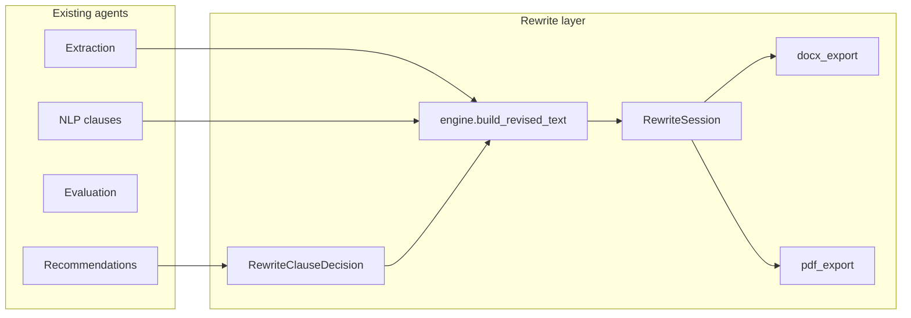

# Contract rewrite + export — implementation plan (delivered)

This document describes what was added for **contract rewrite and download** on top of Agents 1–4, aligned with the MVP → Phase 2 roadmap (deterministic assembly, no external LLM).

## What was added

### Backend

- **Models** ([`backend/app/db/models/rewrite.py`](backend/app/db/models/rewrite.py)):
  - `RewriteSession` — `document_id`, `status` (`draft` / `finalized`), `final_text`, `revision_metadata_json`, timestamps.
  - `RewriteClauseDecision` — one row per **recommendation** in a session (`session_id`, `recommendation_id`, `clause_id`, `decision`: `pending` | `accepted` | `rejected` | `keep_original`), unique on `(session_id, recommendation_id)`.
  - `RewriteExport` — persisted export artifacts (`kind`: `docx` | `pdf`, `file_path`, `size_bytes`, optional `meta_json`).
- **Migration** [`backend/alembic/versions/0007_rewrite_sessions.py`](backend/alembic/versions/0007_rewrite_sessions.py) (revises `0006_agent4_rec`).
- **Rewrite engine** ([`backend/app/services/rewrite/engine.py`](backend/app/services/rewrite/engine.py)):
  - Span-preserving rebuild over `Extraction.normalized_text` using Agent 2 clause `start_char` / `end_char`.
  - Overlapping spans are **clamped** (`clamp_clauses_for_document`) so each position is covered at most once in order.
  - Only recommendations with `decision == accepted` and non-empty `rewritten_clause` replace the clause slice; if several are accepted for the same clause, the **lowest `(priority, id)`** wins (API clears other accepts when one is accepted).
  - `build_revision_metadata` produces an audit list (original excerpt, applied text, `changed`, per-rec decisions).
- **Exports**:
  - [`docx_export.py`](backend/app/services/rewrite/docx_export.py) — `python-docx`: title, optional bullet “Révisions” summary, body split on `\n\n`.
  - [`pdf_export.py`](backend/app/services/rewrite/pdf_export.py) — PyMuPDF A4 pages, chunked plaintext in `insert_textbox`.
- **API** ([`backend/app/api/routes/rewrite.py`](backend/app/api/routes/rewrite.py)), registered in [`main.py`](backend/app/main.py).
- **Tests**:
  - [`tests/test_rewrite_engine.py`](backend/tests/test_rewrite_engine.py) — stitching, priorities, overlap clamp, metadata.
  - [`tests/test_rewrite_export_smoke.py`](backend/tests/test_rewrite_export_smoke.py) — DOCX ZIP structure, PDF header.

### Frontend

- Types in [`frontend/src/types/documents.ts`](frontend/src/types/documents.ts) for rewrite session, decision rows, generate/final payloads.
- API helpers in [`frontend/src/api/documents.ts`](frontend/src/api/documents.ts) (`getDocumentRewrites`, decision POSTs, `postRewriteGenerate`, `getRewriteFinal`, blob downloads for DOCX/PDF).
- [`frontend/src/components/RewriteReviewPanel.tsx`](frontend/src/components/RewriteReviewPanel.tsx) — original vs suggested rewrite, severity badge, flags, legal ref, accept / reject / keep original, generate revised contract, DOCX/PDF download, preview of last finalized text.
- [`frontend/src/pages/UploadPage.tsx`](frontend/src/pages/UploadPage.tsx) — loads rewrites when status is `evaluated` or `complete`, passes errors and refresh into the panel.

### Storage layout

Exports are written under:

`{UPLOAD_DIR}/exports/{document_id}/{session_id}/revised_{session_id}.docx|pdf`

(`UPLOAD_DIR` from [`backend/app/core/config.py`](backend/app/core/config.py).)

## Architecture decisions

| Topic | Decision |
|--------|-----------|
| Source of truth for text | Latest `Extraction.normalized_text` by `id` desc. |
| Clause geometry | Agent 2 `NLPAnalysis.clauses_json` (`clause_id`, `start_char`, `end_char`). |
| Rewrite text | Agent 4 `Recommendation.rewritten_clause` when user **accepts** that recommendation row. |
| One accepted rewrite per clause | `POST .../accept` clears other `accepted` decisions for the same `clause_id` in the session. |
| Session lifecycle | Latest `finalized` session → next `GET /rewrites` creates a **new draft** and seeds decisions for all recommendations. |
| No LLM in MVP | Assembly is pure string + span logic; exports format that text only. |
| PDF engine | PyMuPDF (already a dependency); avoids Word/LibreOffice automation. |

## Data flow



## API endpoints

| Method | Path | Description |
|--------|------|-------------|
| GET | `/documents/{id}/rewrites` | Latest draft session (create if last was finalized); merged recommendations + decisions + clause text/flags. |
| POST | `/documents/{id}/rewrites/generate` | Build `final_text` + metadata; set session `finalized`. Requires `evaluated` or `complete`, extraction, NLP clauses. |
| POST | `/documents/{id}/rewrites/{clause_id}/accept` | JSON body optional `{ "recommendation_id": int }`; default primary rec for clause. |
| POST | `/documents/{id}/rewrites/{clause_id}/reject` | Same optional body; rejects one rec or all for clause if omitted. |
| POST | `/documents/{id}/rewrites/{clause_id}/keep-original` | Same pattern; stores `keep_original`. |
| GET | `/documents/{id}/rewrites/final` | Latest finalized session: `final_text`, `revision_metadata`, export records. |
| POST | `/documents/{id}/exports/docx` | Query `session_id` optional; writes DOCX, returns file download. |
| POST | `/documents/{id}/exports/pdf` | Same for PDF. |

## Database changes

New tables: `rewrite_sessions`, `rewrite_clause_decisions`, `rewrite_exports` (see migration `0007`).

## Frontend changes

- New **Rewrite** panel after recommendations when document is `evaluated` or `complete`.
- Rewrites are refetched after each decision and after generate; final preview uses `GET /rewrites/final`.

## Remaining improvements (Phase 2–3)

**Phase 2**

- Comparison export (original vs revised PDF/DOCX side-by-side or redline-style).
- Compliance report PDF from evaluation + recommendations metadata.
- Richer DOCX structure using `structure_json` when mapping to headings is reliable.
- Pagination / streaming for very large `final_text` previews.

**Phase 3**

- Optional LLM pass for redrafts (behind feature flag + provider abstraction).
- Multilingual templates for revision summaries.
- Highlighted changes in exports (Word comments or PDF annotations).

## How to run migrations and tests

From `backend/`:

```bash
alembic upgrade head
pytest tests/test_rewrite_engine.py tests/test_rewrite_export_smoke.py -v
```

(Requires dependencies from `requirements.txt`.)
